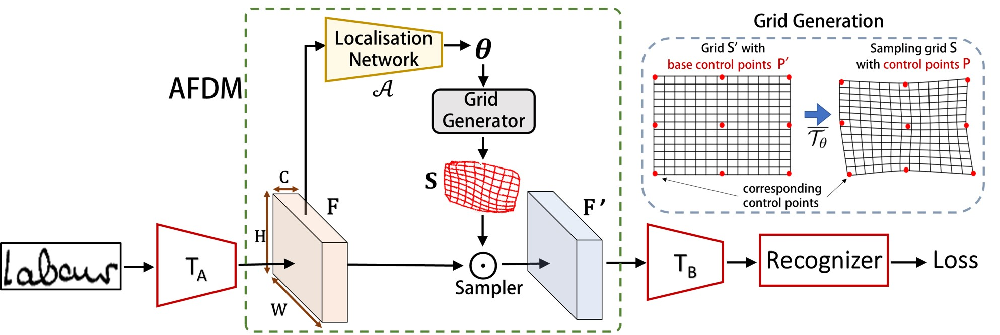

# Handwriting Recognition in Low-resource Scripts using Adversarial Learning, CVPR 2019.
**Ayan Kumar Bhunia**, Abhirup Das,  Ankan Kumar Bhunia, Perla Sai Raj Kishore, Partha Pratim Roy, “Handwriting Recognition in Low-resource Scripts using Adversarial Learning ”, IEEE Conf. on Computer Vision and Pattern Recognition (CVPR), 2019. 

## Abstract
Handwritten Word Recognition and Spotting is a challenging field dealing with handwritten text possessing irregular and complex shapes. The design of deep neural network models makes it necessary to extend training datasets in order to introduce variations and increase the number of samples; word-retrieval is therefore very difficult in low-resource scripts. Much of the existing literature comprises preprocessing strategies which are seldom sufficient to cover all possible variations. We propose the Adversarial Feature Deformation Module (AFDM) that learns ways to elastically warp extracted features in a scalable manner. The AFDM is inserted between intermediate layers and trained alternatively with the original framework, boosting its capability to better learn highly informative features rather than trivial ones. We test our meta-framework, which is built on top of popular word-spotting and word-recognition frameworks and enhanced by the AFDM, not only on extensive Latin word datasets but also sparser Indic scripts. We record results for varying training data sizes, and observe that our enhanced network generalizes much better in the low-data regime; the overall word-error rates and mAP scores are observed to improve as well.

## Architecture



## Citation

If you find this article useful in your research, please consider citing:
```
@inproceedings{bhunia2019handwriting,
  title={Handwriting Recognition in Low-Resource Scripts Using Adversarial Learning},
  author={Bhunia, Ayan Kumar and Das, Abhirup and Bhunia, Ankan Kumar and Kishore, Perla Sai Raj and Roy, Partha Pratim},
  booktitle={Proceedings of the IEEE Conference on Computer Vision and Pattern Recognition},
  pages={4767--4776},
  year={2019}
}
```
